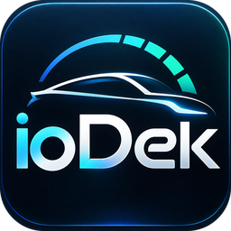

<p align="center"></p>

# ioDek pour Home Assistant

[English below](#english)

Intégration Home Assistant pour [ioDek](https://iodek.fr) (anciennement Vigie), l'application de suivi et de pilotage des Tesla. Elle lit l'API publique d'ioDek (`https://api.iodek.fr/v1`) avec une clé API personnelle.

ioDek est une application indépendante, sans lien avec Tesla, Inc.

Le domaine technique de l'intégration reste `vigie` : les installations existantes continuent de fonctionner sans rien changer, avec leur adresse d'origine (`https://vigie.allyn.fr` reste acceptée).

## Ce que vous obtenez

Un appareil par voiture, avec :

- **Batterie** : niveau de charge, énergie disponible, autonomie, santé (SOH), capacité, cycles, écart entre cellules, températures min et max, tension, courant et puissance du pack.
- **Charge** : état, puissance, énergie ajoutée, **chargé dans** (minutes jusqu'à la limite) et **fin de charge** (heure), énergie de la dernière charge, énergie chargée totale (utilisable dans le tableau Énergie), branchée, en charge, trappe. « Chargé dans » reprend l'estimation de Tesla quand la voiture l'envoie, sinon celle d'ioDek (attribut `source` : `tesla` ou `estimation`).
- **Navigation** (option Localisation) : distance restante, arrivée prévue, batterie à l'arrivée, quand une destination est saisie dans le GPS de la voiture.
- **Voiture** : kilométrage, températures intérieure et extérieure, pression des quatre pneus, verrouillage, portes, coffres, vitres, Sentinelle, climatisation, dernière réception, en ligne ou endormie.
- **Position** (`device_tracker`) si l'option Localisation est active sur la voiture dans ioDek.
- **Commandes**, selon les droits de la clé et les options de la voiture : charge marche/arrêt, limite de charge, intensité, climatisation et consigne, verrouillage, coffres, Sentinelle, sièges et volant chauffants, réveil, klaxon et appel de phares.

Tesla n'envoie une valeur que lorsqu'elle change. Une entité apparaît donc dès que la voiture a transmis la donnée correspondante, parfois quelques jours après l'installation.

Quand la voiture dort, les dernières valeurs restent affichées. Les mesures instantanées (puissance, courant, tension) passent en « indisponible ». « Chargé dans » et « Fin de charge » sont indisponibles hors charge, les capteurs de navigation sans destination.

## Installation

### HACS (dépôt personnalisé)

1. HACS → menu ⋮ → **Dépôts personnalisés**.
2. URL du dépôt, catégorie **Intégration**.
3. Installez **ioDek**, puis redémarrez Home Assistant.

### Manuelle

Copiez `custom_components/vigie` dans le dossier `config/custom_components/` de Home Assistant, puis redémarrez.

## Configuration

1. Dans ioDek : **Compte → Clés API**, créez une clé. Le droit **lecture** suffit pour les capteurs. Ajoutez **charge**, **confort**, **accès** ou **signal** pour obtenir les commandes correspondantes.
2. Dans Home Assistant : **Paramètres → Appareils et services → Ajouter une intégration → ioDek**.
3. Adresse (par défaut `https://api.iodek.fr`) et clé, puis choix des voitures.

Options : intervalle d'actualisation (30 à 300 s, 60 par défaut) et boutons klaxon / appel de phares.

Une commande n'existe que si la clé a le droit **et** si l'option correspondante est active sur la voiture (ioDek → Réglages de la voiture). Si vous changez ces options dans ioDek, l'intégration se recharge d'elle-même.

Le droit **signal** ne peut pas être détecté sans klaxonner : cochez l'option « Boutons klaxon et appel de phares » si votre clé l'a.

## Coûts et limites

- Les lectures viennent de la base d'ioDek et ne coûtent rien. Elles ne réveillent pas la voiture.
- Commandes et réveils consomment des crédits ioDek.
- Une commande ne réveille jamais la voiture : si elle dort, Home Assistant affiche l'erreur et il faut appuyer sur **Réveiller** (3 réveils par heure et par voiture).
- Limites de l'API : 60 lectures et 10 commandes par minute et par clé.

## Service

`vigie.refresh` relit tout de suite les données (toutes les voitures, ou celles passées en `device_id`).

## Clé révoquée

Si la clé est révoquée ou expire, Home Assistant propose d'en saisir une nouvelle (réauthentification).

---

## English

Home Assistant integration for [ioDek](https://iodek.fr) (formerly Vigie), a Tesla monitoring and control app. It reads ioDek's public API (`https://api.iodek.fr/v1`) with a personal API key. ioDek is not affiliated with Tesla, Inc.

The integration's technical domain stays `vigie`: existing installs keep working unchanged, with their original address (`https://vigie.allyn.fr` is still accepted).

**Entities** (one device per car): battery level, energy remaining, range, state of health, capacity, cycles, cell voltage gap, battery temperatures, pack voltage/current/power, charge state and power, energy added, **charged in** (minutes to the charge limit) and **charge end** (time), total energy charged (Energy dashboard ready), odometer, inside/outside temperature, tyre pressures, lock, doors, trunks, windows, Sentry Mode, climate, last data received, online/asleep, GPS position when the car's Location option is on. With Location on and a destination in the car's navigation: distance remaining, expected arrival, battery at arrival. "Charged in" uses Tesla's own estimate when the car sends it, otherwise ioDek's (attribute `source`: `tesla` or `estimation`); it is unavailable when not charging.

**Controls**, created only when the key has the ability and the car option is on: charging on/off, charge limit, charge current, climate and target temperature, lock, trunks, Sentry Mode, seat and steering wheel heaters, wake-up, horn and lights (enable the option: the signal ability cannot be detected without honking).

Tesla sends a field only when it changes, so some entities appear once the car has reported them. While the car sleeps, last known values stay; live measurements (power, current, voltage) become unavailable.

**Install**: HACS custom repository (category Integration), or copy `custom_components/vigie` to `config/custom_components/` and restart.

**Setup**: create a key in ioDek (Account → API keys; `lecture` is required), then add the **ioDek** integration in Home Assistant with the address `https://api.iodek.fr`. Options: update interval 30-300 s (default 60).

**Costs**: reads are free and never wake the car. Commands and wake-ups use ioDek credits. Commands never wake the car; press **Wake up** first (3 per hour). API limits: 60 reads and 10 commands per minute per key.

**Service**: `vigie.refresh` reads fresh data now.

## Development

```bash
python3 -m venv .venv
.venv/bin/pip install -r requirements_test.txt
.venv/bin/pytest -q
.venv/bin/python scripts/build_translations.py   # regenerates strings.json and translations/
```

License: MIT.
